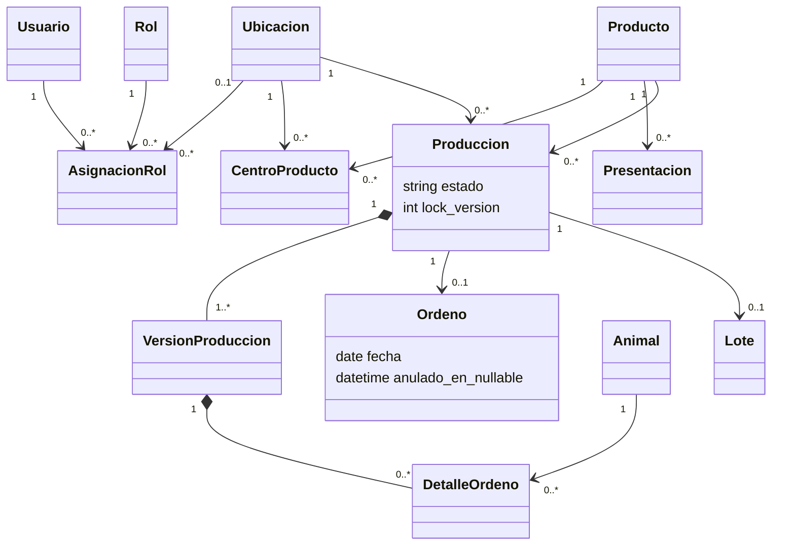
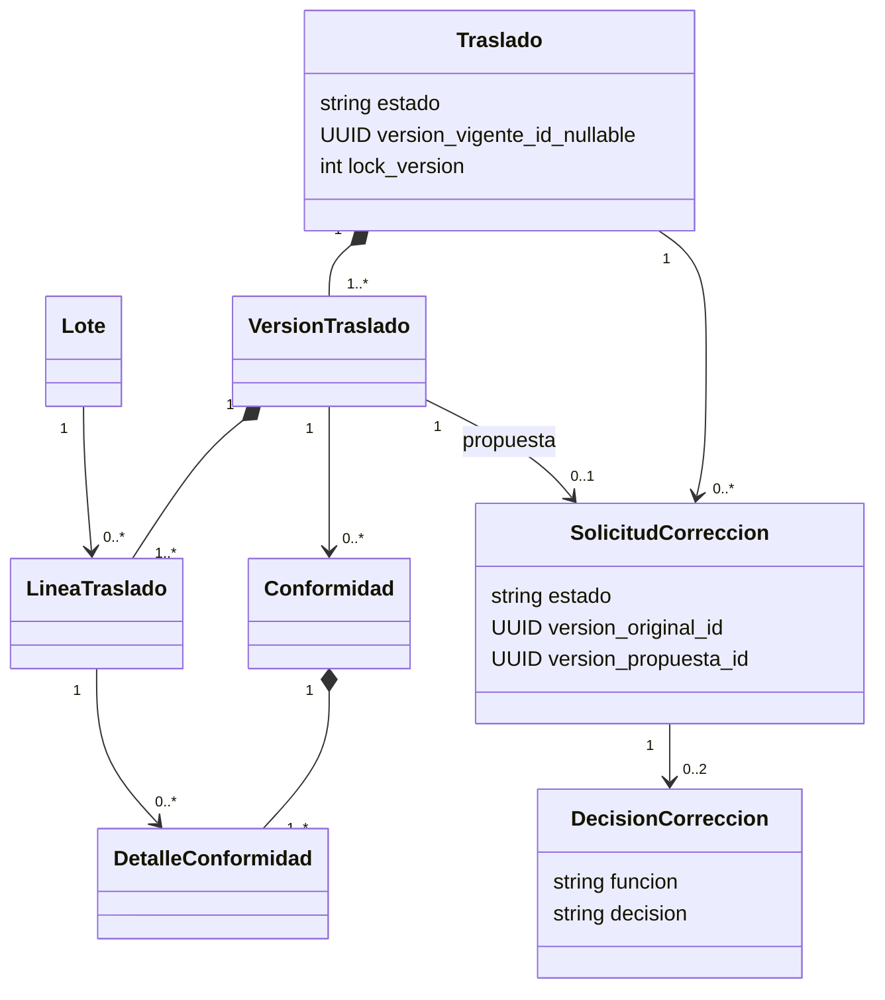
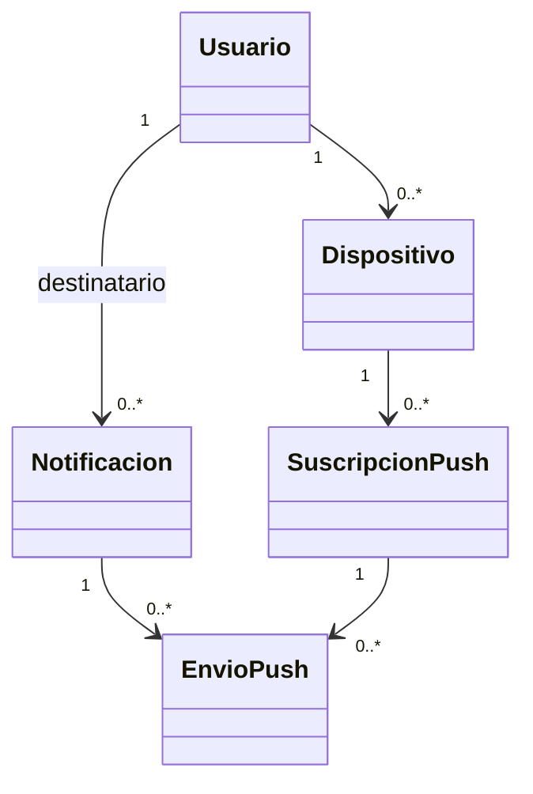

# SITRAP — arquitectura de datos y UML

**Revisión 3 · 2 de octubre de 2026.**  
[General](SITRAP_01_descripcion_general.md) · [Frontend](SITRAP_03_frontend_tareas.md) · [Backend/API](SITRAP_04_backend_tareas.md).

## 1. Alcance y convenciones

PostgreSQL central, núcleo general y especialización para leche. Centros como filas de `ubicacion`, productos como filas de `producto`, animales individuales cuando el proceso lo necesita. Cuyes y su inventario mensual se diseñarán posteriormente; no forzar su existencia inicial a una producción lechera.

El MVP no implementa inventario físico, venta, merma, mezcla, incidencia de pérdida ni recepción con diferencia. Una confirmación acepta una cantidad exacta. Si alguien no puede aceptarla, la deja pendiente y coordina; no existe confirmación automática. Errores documentales se corrigen con el flujo de dos aprobaciones descrito aquí.

PK de negocio UUID, códigos humanos separados, cantidades Decimal(14,3), bolsas enteras de 1 L en el piloto. No convertir kg a L sin una regla validada. Tiempos UTC/timestamptz; fecha operativa y reportes en America/Lima. `ocurrio_en` es hora declarada; `registrado_en` es hora del servidor. Cero explícito es distinto de dato faltante.

FK de historial protegidas. Catálogos utilizados se desactivan. Versiones publicadas, conformidades y decisiones son inmutables; las correcciones agregan evidencia. Reglas entre tablas se validan en servicios transaccionales; no se presentan como simples CHECK SQL entre tablas.

## 2. Glosario único de versiones

| Campo | Significado |
|---|---|
| `lock_version` | Entero del agregado mutable; aumenta en cada cambio de negocio, incluso al editar borrador. |
| `expected_version` | Valor de lock_version que el cliente leyó y envía para detectar una modificación concurrente. No es otro campo persistente del agregado. |
| `version_id` | UUID de una fotografía documental de cantidades y participantes. Las confirmaciones apuntan a este contenido. |
| `numero` | Secuencia legible de versiones documentales dentro de una producción o entrega. |

Solicitudes de corrección tienen su propio lock_version para decisiones concurrentes. Aceptar una propuesta compara su versión, no una cifra distinta de la que vio el usuario. Apertura/cierre de una corrección también cambia lock_version del traslado. Marcar un aviso leído no cambia el traslado.

## 3. UML — cuentas, catálogos y producción

Un borrador aún no tiene lote; una producción confirmada tiene uno. Detalles por vaca pertenecen a la versión de producción. El lote identifica el ordeño conjunto, no permite atribuir físicamente cada bolsa a una vaca.

## 4. UML — entrega y corrección

La FK `version_original_id` permite varias propuestas sucesivas rechazadas sobre la misma versión original. La propuesta es única de su solicitud. La ruta `/corrections/{id}` identifica `solicitud_correccion.id`.

## 5. UML — avisos y push

## 6. Diccionario — acceso y catálogos

| Tabla | Campos y restricciones |
|---|---|
| usuario | UUID, username único, nombre, activo, contraseña gestionada por Django, cambio_password_requerido. |
| rol | PRODUCCION, TRANSPORTE, RECEPCION, ADMIN. |
| asignacion_rol | usuario, rol, ambito GLOBAL/UBICACION, ubicacion nullable, desde/hasta. GLOBAL exige NULL y solo ADMIN; UBICACION exige FK. Unicidad de asignación activa equivalente. |
| ubicacion | código, nombre, tipo CENTRO/PUNTO_VENTA, activo. Tránsito es estado del traslado, sin ubicación de inventario en este MVP. |
| unidad | código L/KG/UN, nombre. |
| producto | código único, nombre, unidad_base, activo. |
| centro_producto | centro, producto, habilitado, UNIQUE(centro,producto). Define catálogo disponible; no guarda cantidades. |
| presentacion | producto, nombre, contenido_base>0, admite_fraccion, activo. Piloto: bolsa de 1 L indivisible. |
| especie | código, nombre. |
| animal | código único, especie, sexo, nombre opcional, ACTIVO/INACTIVO. |
| estancia_animal | animal, centro, desde/hasta; sin períodos superpuestos; ubicación válida al ordeñar. |
| turno | código, nombre, activo. “Diario” solo semilla de demostración hasta validar turnos. |

Conductor: rol TRANSPORTE en origen y asignación en entrega. Receptor: rol RECEPCION en destino y asignación en entrega. Producción opera sobre sus centros. ADMIN consulta globalmente. Matriz completa por acción: documento 04. El listado de opciones asignables retorna datos mínimos y no habilita acceso a todo `/users`.

## 7. Diccionario — producción y anulación

| Tabla | Campos y restricciones |
|---|---|
| produccion | producto, centro, responsable, tipo, estado BORRADOR/CONFIRMADA/ANULADA, version_actual_id, lock_version. |
| version_produccion | producción, numero, cantidad, estado BORRADOR/PUBLICADA/SUPERADA, autor, motivo, publicada_en. UNIQUE(producción,numero). |
| ordeno | produccion OneToOne, centro, fecha, turno, anulado_en nullable, reemplaza_ordeno_id nullable. Índice único parcial (centro,fecha,turno) WHERE anulado_en IS NULL. |
| detalle_ordeno | version_produccion, animal, litros>=0, UNIQUE(versión,animal). Solo para producción de leche. |
| lote | producción OneToOne NOT NULL, código único, creado_en. Producto y origen derivados de producción; cantidad documental de su versión vigente. |

Centro del ordeño coincide con producción. `ordeno.anulado_en` y estado ANULADA del agregado se actualizan juntos por el servicio transaccional; no exponer cambios separados de esos campos. El índice condicional usa campos de la misma tabla. Probar carreras entre anulación y alta del reemplazo.

Confirmar exige detalles completos y total positivo, crea versión publicada y lote una sola vez. Guardar borrador admite incompletos sin convertir vacío en cero. Al anular se conserva historial y se libera la combinación centro/fecha/turno; se bloquea si hay entregas publicadas no canceladas o propuestas activas sobre su lote. El reemplazo puede enlazar al anulado sin reutilizar su lote.

Rectificar producción: PRODUCCION de ese centro crea una versión completa con motivo; conserva la versión anterior. Solo litros por vaca/total. Debe cubrir las asignaciones documentales máximas de sus lotes. No cambia automáticamente entregas aceptadas. Fecha/turno/centro/producto de producción confirmada se corrigen mediante anulación y reemplazo solo cuando no hay vínculos que lo impidan. No hay una vía especial para cambiar esos datos una vez relacionados con entregas activas.

## 8. Diccionario — traslado y conformidades

| Tabla | Campos y restricciones |
|---|---|
| traslado | código único, creador, estado BORRADOR/PENDIENTE_RECOGIDA/EN_CAMINO/RECIBIDO/CANCELADO, version_vigente_id, lock_version. |
| version_traslado | traslado, numero, origen, destino, emisor, conductor, receptor, estado BORRADOR/PROPUESTA/PUBLICADA/SUPERADA/RETIRADA, motivo, publicada_en. UNIQUE(traslado,numero). |
| linea_traslado | versión, lote, presentación, unidades_presentacion, contenido_base_snapshot, cantidad_base. UNIQUE(versión,lote,presentación). Cantidad positiva y compatibilidad de producto/unidad. |
| conformidad | versión, etapa ENTREGA_ORIGEN/RECOGIDA/RECEPCION, usuario, ocurrio_en, registrado_en, operacion_id. UNIQUE(versión,etapa). Las etapas físicas se admiten una sola vez por traslado, incluso tras cambiar versión; servicio bloquea traslado y comprueba toda su cadena. |
| detalle_conformidad | conformidad, línea, cantidad_aceptada, UNIQUE(conformidad,línea); servidor copia cantidad de la versión mostrada. |
| auditoria | actor, entidad/tipo, acción, antes/después JSON, motivo, fecha, operación; append-only y sin credenciales. |

En piloto, cada entrega lleva una línea y lote, aunque el esquema admite más. Confirmación normal acepta todo el documento. Producción genera ENTREGA_ORIGEN al publicar. Conductor acepta RECOGIDA; receptor acepta RECEPCION. No existe una cuarta captura de Lolo al entregar.

Antes de recogida, producción puede publicar una nueva versión con cambios permitidos en cantidades y asignación; conserva la declaración original y genera nueva declaración origen. Cambiar el lote u origen de una solicitud publicada se resuelve cancelando y preparando otra. La versión obsoleta deja de ser confirmable. Tras recogida, participantes/origen/lote/destino quedan fijos para el flujo de corrección de cantidades.

## 9. Solicitudes de corrección y decisiones

| Tabla | Campos y restricciones |
|---|---|
| solicitud_correccion | traslado, version_original, version_propuesta OneToOne, solicitante, motivo obligatorio, aprobador_transporte, aprobador_recepcion, estado PENDIENTE/APLICADA/RECHAZADA/RETIRADA, lock_version, creada_en, finalizada_en. Máximo una PENDIENTE por traslado mediante índice parcial. |
| decision_correccion | solicitud, funcion TRANSPORTE/RECEPCION, usuario, decision ACEPTAR/RECHAZAR, motivo obligatorio si rechaza, decidido_en, registrado_en, operacion_id. UNIQUE(solicitud,funcion). |

Reglas canónicas:

1. Solo después de recogida. Producción de origen propone una cantidad concreta y positiva de la misma línea, lote y presentación, junto con motivo. La propuesta y sus aprobadores quedan fijos.
2. Transporte aprueba con la cuenta que confirmó recogida. Recepción aprueba con la cuenta que confirmó recepción o, si aún no ocurrió, con el receptor asignado. En el piloto son dos cuentas diferentes; una misma persona no puede completar ambas aprobaciones de una propuesta. Si no se cumple, corregir la asignación operativa antes de usar este flujo, sin falsificar autores históricos.
3. Se requieren dos ACEPTAR, en cualquier orden. Abrir el aviso o leer la propuesta no cuenta como decisión. Revalidar cuenta activa y permiso actual al decidir.
4. Mientras está PENDIENTE, la versión vigente anterior conserva efecto y la recepción física nueva queda bloqueada. Las aprobaciones están habilitadas: María puede aprobar la corrección aunque aún no haya recibido. La UI explica ambas acciones por separado.
5. La segunda aprobación adquiere los bloqueos de producción, lote, traslado y solicitud en el orden único de 04 §3; revalida cantidades/asignaciones, aplica versión propuesta, marca anterior SUPERADA y solicitud APLICADA. Todo es una sola transacción junto con auditoría y notificaciones. Una carrera de aceptación/rechazo tiene un único resultado terminal; la otra recibe conflicto.
6. Aplicar NO cambia estado logístico, hora de recogida ni hora de recepción. Si estaba EN_CAMINO, María deberá confirmar recepción después. Si estaba RECIBIDO, sigue recibido con cantidad documental corregida. Las conformidades originales no se editan ni se copian fingiendo una nueva firma; las decisiones justifican el nuevo valor vigente.
7. Un RECHAZAR termina la solicitud como RECHAZADA, retira propuesta y conserva la versión original. Producción puede retirar su solicitud PENDIENTE, incluso si tenía una aceptación; la decisión histórica permanece pero no se reutiliza. Tras rechazo/retiro se libera el bloqueo y permanece pendiente la recepción que faltase.
8. Nueva cifra requiere nueva solicitud y aprobaciones nuevas. No editar payload ni cambiar aprobadores después de crearla. No hay aplicación por ADMIN, vencimiento automático ni delegación retrospectiva. Si falta respuesta, permanece PENDIENTE.

Después de una corrección aplicada, una nueva solicitud toma esa versión como original. Si María aún no recibió, se mantiene el mismo receptor designado; cambiarlo con correcciones ya abiertas o aprobadas queda fuera del piloto. Esto evita que una aprobación se transfiera silenciosamente a otra persona.

## 10. Estados y transacciones

| Acción | Estado inicial | Resultado |
|---|---|---|
| Confirmar producción | BORRADOR | CONFIRMADA + lote. |
| Rectificar litros por vaca | CONFIRMADA | CONFIRMADA, nueva versión, historial conservado. |
| Anular producción sin vínculos activos | BORRADOR/CONFIRMADA | ANULADA y anulado_en; permite reemplazo. |
| Enviar entrega | BORRADOR | PENDIENTE_RECOGIDA + origen + aviso a transporte. |
| Revisar antes de recogida | PENDIENTE_RECOGIDA | Mismo estado, versión nueva y aviso actualizado. |
| Confirmar recogida | PENDIENTE_RECOGIDA | EN_CAMINO + aviso a recepción. |
| Confirmar recepción | EN_CAMINO, sin corrección PENDIENTE | RECIBIDO + avisos a emisor/conductor. |
| Cancelar | BORRADOR/PENDIENTE_RECOGIDA sin recogida | CANCELADO, libera asignación documental. |
| Solicitar corrección | EN_CAMINO/RECIBIDO | Mismo estado logístico y propuesta PENDIENTE. |
| Aplicar/rechazar/retirar propuesta | Propuesta PENDIENTE | Mismo estado logístico y resultado documental correspondiente. |

Las versiones de producción pasan BORRADOR → PUBLICADA y la anterior PUBLICADA → SUPERADA al rectificar. Anular afecta al agregado y conserva sus versiones como evidencia. Las versiones de traslado pasan BORRADOR → PUBLICADA al enviar; una revisión publica otra y supera la anterior. Una propuesta de corrección nace PROPUESTA y pasa a PUBLICADA solo con dos aceptaciones, o a RETIRADA por rechazo/retiro. Cancelar afecta al traslado; no borra ni reetiqueta sus documentos publicados como si nunca hubieran existido. Solo hay una versión vigente por agregado y una propuesta pendiente por traslado.

No almacenar estados de lote, venta o pérdida inexistentes. La UI presenta logística y estado de corrección por separado. No equiparar RECIBIDO a vendido o pagado.

Para cada lote: producido vigente menos cantidades de versiones vigentes publicadas no canceladas = no vinculado. Una corrección PENDIENTE consume documentalmente el máximo por lote entre versión vigente y propuesta. Borradores no reservan. Bloquear lotes en publicación, corrección y rectificación de producción impide sobreasignación concurrente. No vinculado no es stock físico verificado.

Métricas de recogido/recibido usan la etapa física alcanzada y cantidad de la versión vigente, identificando si fue corregida. La evidencia muestra cantidades originales y decisiones; no suma todas las versiones. Fechas de la operación física permanecen originales. PDF indica su corte y que incluye rectificaciones vigentes a ese corte.

## 11. Notificaciones persistentes y suscripciones

| Tabla | Campos y reglas |
|---|---|
| dispositivo | UUID, usuario, nombre, activo, preparado_en, preparacion_expira_en, ultimo_contacto. |
| notificacion | UUID, destinatario, tipo, evento_origen_id, entidad_tipo/id, version_referida_id nullable, titulo, texto, creada_en, leida_en nullable. UNIQUE(destinatario,evento_origen_id,tipo). No leído no equivale a pendiente de negocio. |
| suscripcion_push | dispositivo, usuario, endpoint único, p256dh, auth, activa, creada_en, actualizada_en, revocada_en. Vinculación válida solo con propietario autenticado del dispositivo. |
| envio_push | notificación, suscripción, estado PENDIENTE/PROCESANDO/ACEPTADO_PROVEEDOR/REINTENTABLE/FALLIDO/DESCARTADO, intentos, proximo_intento_en, lease_hasta nullable, ultimo_error, actualizado_en. UNIQUE(notificación,suscripción). |

`envio_push` es la outbox durable del servidor. En la transacción de negocio se crea aviso interno y un envío por suscripción activa; un worker lo procesa tras commit. `ACEPTADO_PROVEEDOR` no asegura lectura ni visualización en teléfono. No existe `leida_en` inferida por recibir un push; se marca mediante API autenticada.

Errores temporales: reintento con espera creciente y límite configurable. Endpoint expirado: desactivar suscripción, sin perder aviso interno. Transiciones de envío: PENDIENTE/REINTENTABLE → PROCESANDO al reclamar; PROCESANDO → ACEPTADO_PROVEEDOR, REINTENTABLE, FALLIDO o DESCARTADO según resultado. Suscripción inactiva descarta; error permanente o límite agotado falla. Un lease vencido permite recuperar un PROCESANDO como REINTENTABLE. No se reenvían estados terminales automáticamente. Un worker que cae libera su trabajo por vencimiento del lease. La entrega externa puede ser al menos una vez: usar notificacion.id como tag/id estable y no ejecutar acciones de negocio al recibir un push.

Payload mínimo: identificador y mensaje genérico, sin credenciales ni autorización. Al tocar, la app inicia sesión si es necesario y consulta el registro autorizado y su estado actual. Un aviso antiguo de v1 no permite confirmar v1 si ya existe v2. Logout/desactivación desvincula o desactiva suscripciones; el worker revalida propietario/estado antes de enviar. No prometer retirar un aviso ya mostrado por el sistema operativo.

Tipos, destinatarios y contratos de notificación: fuente única documento 04 §6. Notificaciones leídas se conservan según retención configurada; no borrar historial operativo por limpiar una bandeja.

## 12. Sincronización

`operacion_sync(event_id UUID único, usuario, dispositivo, tipo, entidad_id, expected_version, payload_hash, payload validado, ocurrio_en, recibido_en, estado, resultado, error)` y `dependencia_sync(operacion_id, depende_de_event_id UUID)` con par único. Padre ausente permitido en esa referencia; no crear una FK que impida recibirlo después.

Estado central: RECIBIDA/ESPERA_DEPENDENCIA/APLICADA/RECHAZADA. RECIBIDA pasa a espera si falta un padre; al resolver dependencias vuelve a evaluarse y termina APLICADA o RECHAZADA. Una dependencia rechazada termina también al hijo como RECHAZADA. Estados terminales no se reabren al repetir el UUID. Reintento idéntico recupera resultado; mismo UUID con payload/actor diferente es conflicto. Cambio de negocio, acuse, aviso interno y outbox de push se confirman juntos. Error de envío push no revierte la recogida ni obliga a repetirla.

El catálogo exacto de comandos y payloads está únicamente en documento 04 §5. No copiar otra lista independiente en migraciones o documentación. Esquemas OpenAPI/validadores son fuente ejecutable al implementar.

La outbox de IndexedDB usa PENDIENTE/ENVIANDO/APLICADA/REQUIERE_SESION/ESPERA_DEPENDENCIA/RECHAZADA. Ordena dependencias, retoma ENVIANDO después de cierre con el mismo UUID, conserva rechazos. Confirmaciones/aprobaciones solo sobre documentos descargados; no existen avisos remotos de una captura aún local.

Bootstrap incluye catálogos, permisos, opciones de asignación, vacas, lotes, entregas abiertas aunque sean antiguas, versiones, conformidades, correcciones propias y avisos. Historial reciente de 30 días por defecto, paginado; cursor de cambios estable con desactivaciones/revocación. Notas sin solicitud se vinculan manualmente después, nunca por aproximación automática.

## 13. Reemplazos y crecimiento

ADMIN puede asignar funciones a otra cuenta. Antes de recogida se publica revisión para cambiar conductor/receptor, dejando sin efecto avisos accionables anteriores. Tras recogida, solo puede cambiar receptor antes de recepción si no existe ninguna solicitud de corrección sobre la entrega; evento auditable de reasignación, sin cambiar la cantidad aceptada por transporte. La UI y la API validan esta restricción. El conductor que recogió no se reemplaza en la evidencia histórica.

La expansión reutiliza centro_producto y módulos. Galpones, pozas/jaulas, conteo mensual de cuyes y origen de lotes por existencia inicial se incorporarán mediante migraciones específicas. No se incluyen ahora tablas de inventario vacías ni selección de lote de venta sin requisitos. Los usuarios ven solo productos/módulos habilitados y autorizados.

## 14. Verificación requerida

Pruebas junto a cada tarea: cuenta/ámbito, unicidad no anulados y reemplazo, detalle por vaca, lote único, sobreasignación concurrente, doble clic, versión obsoleta, carrera edición/recogida, dos aprobaciones y rechazo concurrente, invariancia de etapa física al corregir, bloqueo de recepción mientras propuesta pendiente, ausencia de aprobación administrativa, outbox tras commit, duplicación push sin efecto de negocio, suscripción de otra cuenta, logout, dependencias offline y métricas/PDF sin doble conteo.
